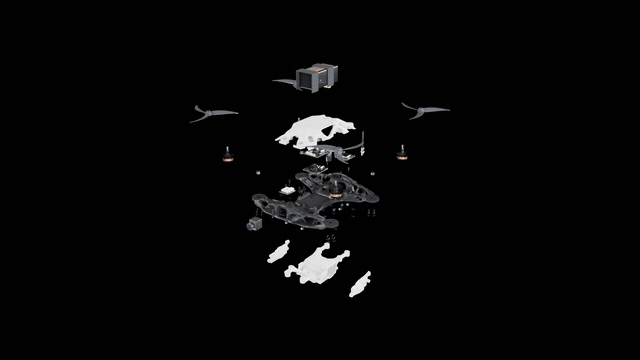
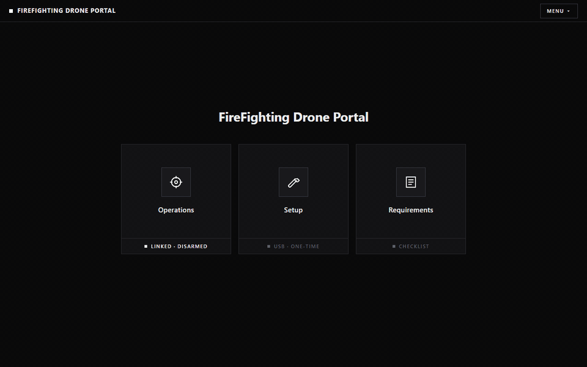

# Firefighting Drone

  
  &nbsp;
  

Turn almost any FPV drone into a firefighting drone, or print the frame from
`stl/` and build one with the same parts. Click a building on the map: the
drone flies there by itself, drops a 0.5 kg extinguisher ball and comes home.
The pilot's radio overrides it at any moment.

Runs on ArduCopter (SpeedyBee F405 V5 tested). Progress and parts:
[docs/project-status.md](docs/project-status.md).

## Install (Windows 10 or 11, 64-bit)

1. Click the green **Code** button, then **Download ZIP**. Unzip it anywhere.
2. Double-click **Install** in the folder. Windows may ask once if you are
   sure. It downloads a private copy of Python and the packages into the
   folder (about 60 MB). No admin rights; nothing else on the laptop is touched.
3. Double-click **FireFighting Drone Portal** on the Desktop (or **Start** in
   the folder). The portal opens at http://127.0.0.1:8008.

Flashing a board for the first time may need the USB driver for its
bootloader once. The Setup page says so when it happens and names the tool
(ImpulseRC Driver Fixer).

## The portal

- **Requirements** shows what is installed, what is plugged in and what is missing.
- **Setup** converts a Betaflight quad, or sets up a fresh build, one step at a
  time with pictures. USB cable in. Every value written is read back, and
  nothing is written while the aircraft is armed. Fresh-build mode is new and
  has not been flown end to end yet; issues and pull requests are welcome.
- **Operations** is the map: set your site, place the factory pins, send the
  drone. Cable out; Bluetooth links by itself when the drone is powered. A
  mission that contradicts the fence on the aircraft is refused.

Your site, pins and settings stay on your laptop (`console/site.json`,
`console/settings.json`); they are not part of the repository.

## Simulation

`.python\python.exe console\fire_console.py --sim` boots ArduPilot SITL at your
site and serves the same portal, so missions can be rehearsed without the
aircraft. Needs SITL for Windows in `tools/sitl/` (not in the repository).

## Folders

| Folder | What is in it |
|---|---|
| `console/` | The portal: web pages and the Flask server |
| `fc/` | Flight controller tools: flashing, parameters, Bluetooth bridge, Betaflight translation |
| `docs/` | Project status and parts |
| `stl/` | 3D-printable dropper parts: body, cover, payload |

## Safety

- The radio always wins: the mode switch takes over from the autopilot at once.
- Geofence, battery and radio failsafes are set in Setup and checked before
  every mission.
- Dropping objects from a drone and flying beyond line of sight are regulated
  in most countries. Test with an inert dummy ball, within sight, over ground
  you control, and check local rules before any real use.
